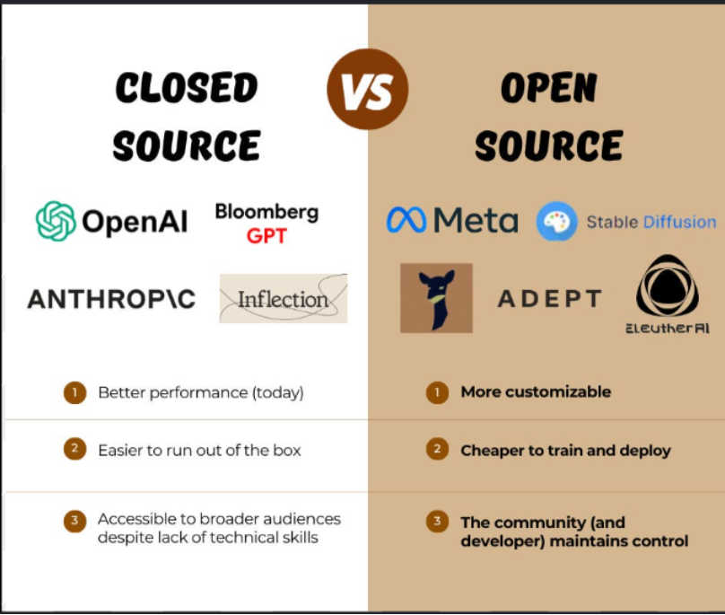
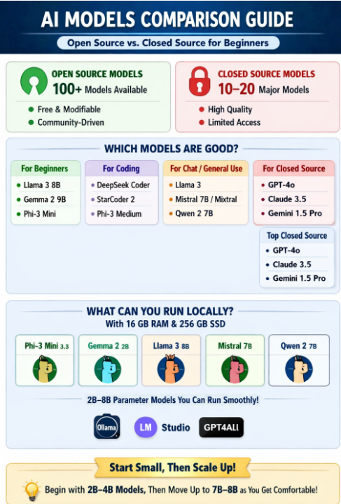
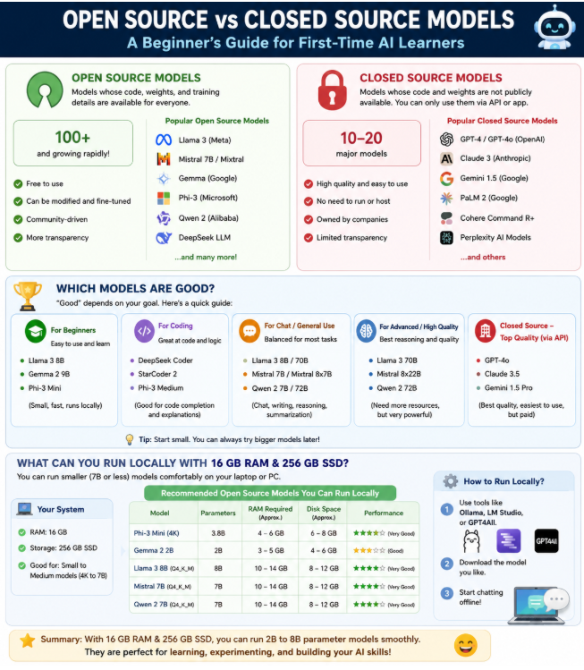

# Research about the Open source Model vs Close Model

- **Author:** Navneet Sharma - QA Engineer

---

## How many open source models are there?

Open source: There are tens of thousands of open-source AI models available. The exact number is impossible to pin down because anyone can continually fine-tune or modify existing ones. The vast majority of these models are hosted and continuously updated on the Hugging Face platform

---

## How many closed source models are there?

Closed source: There is no exact, universally agreed-on number of closed-source AI models, but major tech companies have launched and maintained dozens of proprietary foundation models. Instead of a single count, the AI landscape features distinct tiers of closed-source models managed by major AI vendors.

## Which models are good?

